# Esther vs The Machine at ICFPPC 2026
_July 30, 2026_

---

<p align="center">
<em>
In the era of contests, of AI, and of slop tired and sorry,
</br>
of heroes, and villains, and ideals old and starry,
</br>
stood those scrappy young upstarts called <a href="https://github.com/self-atari/icfp2025/blob/main/writeup/writeup.md">self.atari</a>.
</br>
</br>
They were <a href="https://github.com/prendradjaja">Pandu</a> and <a href="https://github.com/eswitbeck">Esther</a>. How they fought to survive!
</br>
and by sheer force of will, kept their standing alive
</br>
at the ICFP, in two thou' twenty-five.
</br>
</br>
But then in 'twenty-six, Pandu reached out by phone.
</br>
He was out finding wins <a href="https://gocongress.org/">over board and with stone</a>!
</br>
Of the duo remained: just fair Esther, alone.
</br>
</br>
As she then found herself on a one-woman team,
</br>
to pretend names of old would seem somewhat obscene.
</br>
Thus she christened her "group", <strong>Esther vers' The Machine</strong>.
</em>
</p>

---

Yes, a second year, and a second attempt at the [International Conference of
Functional Programming contest](https://icfpcontest2026.com/), this time by myself! As a
prelude refresher, this is a 72-hour annual programming contest. The premise is:
usually a very hard problem (or a series of problems that ends in something very
hard), with an open choice of programming language, and a prize of... well,
winning. There are plenty of solo groups, but teams of any size are allowed so
competition is steep. As for me, my goal is just to improve my bottom-of-the-list
ranking from last year.

Whereas the previous competition took its inspiration from <em>The Name of the
Rose</em>, this round takes another literary source:
<p align="center">
  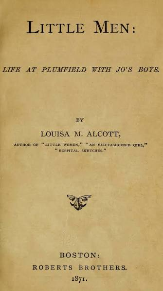
</p>
<p align="center"><em>
    Why Louisa May Alcott's more well-known book wasn't chosen is probably</br>
    a pointed question better aimed at computer science in general
</em></p>

...or rather, the little men that, as we all know, run about in our computers to
make them work. Did I mention the contest usually comes with a sense of humor?

More specifically, participants are given a new programming language of 'little
men' (represented with `@`, NetHack-style) in 2D text-art 'rooms' and asked to solve
a series of increasingly ridiculous problems in it.

<p align="center" style="font-size:20px;">
<code class="language-list">+----+         +----+
|   @|         |    |
|    |         |@   |
+----+         +----+
Hello!           Hi! 
</code>
</p>

There are 12 problems to start, with 4 to be added after the 'Lightning Round' of
the first 24 hours. You get 1 point if your boxes and men solve the problem
correctly and up to 1 more point depending on how close to the best solution
yours is (it's also possible to see team ranking by problem). Scoring rewards
small and fast (but especially small) solutions.

Men walk about one space at a time, changing direction when they walk over arrows
(`<`, `>`, `^`, `v`), holding numbers in their two hands, and performing
operations on those numbers (or changing direction) depending on the characters they step on.

Since they're[^count] constrained to one man per room, they have to send numbers
to each other through 'pipes', which I like to imagine as tin-can telephones.

[^count]: In the early round, at least.

<p align="center" style="font-size:20px;">
<code class="language-lisp">+----+        +----+
|   @|>---v   |    |
|    |    >-->|@   |
+----+        +----+
Sending      Got it!
 a 7!               
</code>
</p>

But the best part is that the website came with a beautiful visual debugger for
little man programs. Spaces are different colors, you can watch the little guys
run around and click to see what they're holding, you can add your own test
cases... it's fantastic.

<p align="center">
  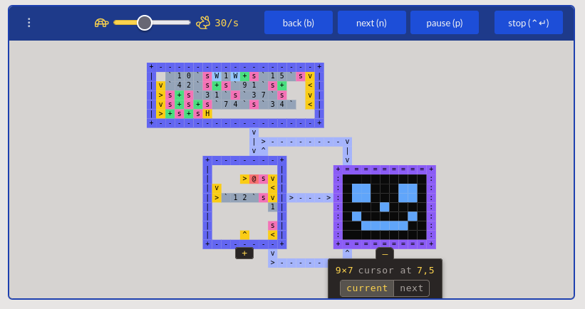
</p>
<p align="center"><em>They can even draw pictures!</em></p>

I tried to keep a couple lessons from last year's foray in mind:
- Don't stay up late. At all. Just work during normal hours. There will not be
  anything productive done after 11pm.
- Move on to something new as soon as it looks like the approach is wrong. It
  feels better to get a score for the obvious solution than to think of (and not
  implement) something clever.
- Long breaks are also good!

Then there was the question of whether or not to use an LLM during the contest
(it's freely allowed). Some teams had announced the expected all-in or all-out
stances beforehand, but I made my choice at the last minute. I spend most of my
time at work these days talking to Claude, so avoiding it completely sounded like
a pleasant contrast.

And with that, I was off, comfortably starting more than 4 hours after the
contest's 5am start!

<p align="center">
  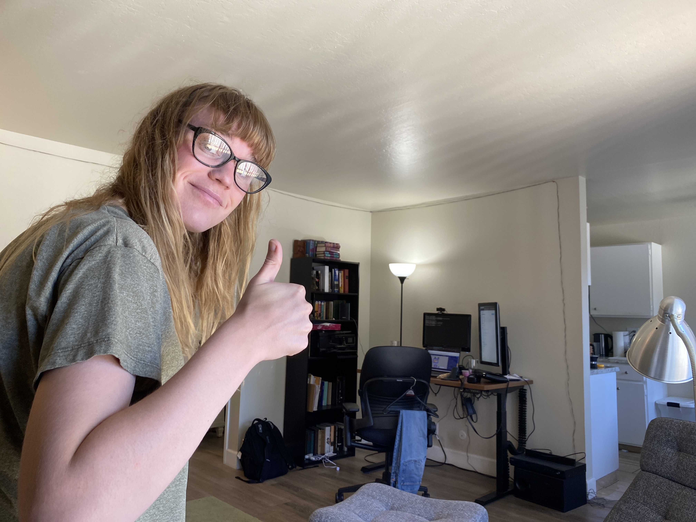
</p>

## Day 1

### Problem 1: Triangle

If the debugger made approaching the problems easy, it made writing this one
effortless. The problem is to generate the `n`th [triangular
number](https://en.wikipedia.org/wiki/Triangular_number). If you know the trick
to calculating these, it's a very simple formula. You don't even have to write 'real' code for this
one--you can just put it directly in the editor!

<p align="center">
  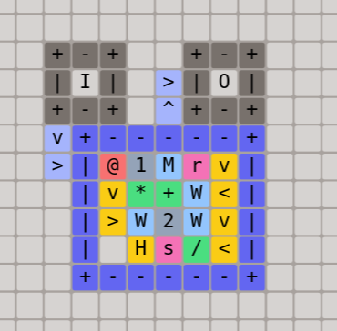
</p>
<p align="center"><em>The I and O are how the little men hear about the problem</em></p>

Thanks to live standings, it was possible to see that several teams were winning
with the same lower score. Along with pretty much every other participant, I
tried to work backwards from that score and figured there must be a solution in
8x8 and 13 steps. Try as I might, I couldn't quite fit it in less than an 8x9
box.

### Problem 3: Reverse a List (or: The Problem with Pipes)

After a nice walk outdoors (breaks!) I came up with a clunky solution to
reversing a list of numbers. You can just look at the list over and
over and send out the last number in it (then remove that number). It's not a
good algorithm, but it at least should work.

But there's a problem. As soon as a man picks up too many numbers, he
starts to lose them. He just doesn't have enough hands! So if you want to get the
last number in the list, you have to put the rest somewhere. You can't
have a man pipe back to himself, but you _can_ have a second room to block all
the numbers in the pipe and send them back when you're ready.

<p align="center" style="font-size:20px;">
<code class="language-lisp">+----+        +----+
|   @|>------>|    |
|    |<------<|@   |
+----+        +----+
Hold these     Sure!
 for me?            
</code>
</p>

Then there's a new problem. How do you know when you're ready? You risk moving so
fast that you get your same list back before you're done with it. A little man
race condition! Any recursive little man strategy has this problem--you need
stack frames and memory is very scarce. I figured you could add a second pipe as
a channel for announcing completion with the full list.

<p align="center" style="font-size:20px;">
<code class="language-lisp">+----+        +----+
|    |>------>|    |
| @  |<------<|@   |
+----+        +----+
  v^           v^   
  |^-----------<|   
  >-------------^   
 wait, wait...      
 ok, ready!         
</code>
</p>

You start to run out of space very quickly--pipes do _not_ cross. But I made the
mistake of being excited that I could think of boxes as functions and started to
plan off of it.
[^reverse]

[^reverse]: Basically:
    ```lisp
    (defun sloppy-reverse (l)
      (if (null l)
          nil
          (progn (output (last l))
                 (sloppy-reverse (butlast l)))))
    ```

<p align="center">
  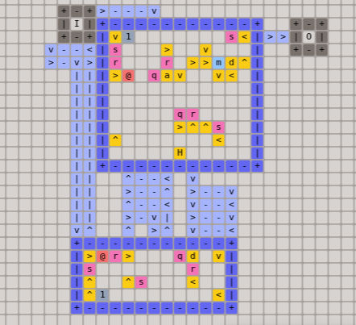
</p>
<p align="center"><em>Busy, but it works!</em></p>

## Day 2

I began thinking about how the hardest questions (like drawing the results of a
pathfinding algorithm) could be addressed. It would be extremely difficult to do
them by hand, but it might not be too hard to write a transpiler for a simple
Domain Specific Language[^macro]. I thought there were two main ways of doing
this: either you design a language that ignores room layout and handle that with
the transpiler[^transpile], or you 'prefab' a bunch of small rooms and assemble
them later. I was assuming top teams would probably do the latter.

[^macro]: Not to sound like too much of a stereotype, but I'm pretty sure lisp
    macros would make the whole parsing bit of this a lot easier!

[^transpile]: There are a lot of disincentives, though. How do you map program
    control flow to 2D? A directed graph? And then how do path intersections
    work? Plus, if the pipes are too far away, little men can send numbers to the
    wrong one! So it's not possible to think only in terms of isolated rooms and
    figure out connections later.

I sketched out the beginnings of what could be a syntax based on what I had done
so far in [sort.pseudo](../sort.pseudo). I didn't want to start with that, but if
nothing else it might help me organize my thoughts while I attempted a sorting
problem by hand.

Reader, I did not write this transpiler.

### Problem 4: Sort

Well, some of this work happened the day prior. There was a _lot_ of bashing my
head into the wall. My starting point was coming up with a (inefficient, and,
more embarrassingly, incorrect) rendition of a sort algorithm apparently called
[meansort](https://dl.acm.org/doi/pdf/10.1145/2163.358088).[^lisp]

[^lisp]: This li'l mess:
    ```lisp
    (defun half-sort (len l)
      (if (= 1 len)
          l
          (let* ((avg (/ (loop for i in l sum i) len))
                 (less-than (filter (lambda (l) (>= avg l)) l))
                 (greater-than (filter (lambda (l) (< avg l)) l)))
            (append (half-sort (length less-than) less-than)
                    (half-sort (length greater-than) greater-than)))))
    ```
    [^author]

[^author]: Speaking of <em>Little Women</em>, the (real) algorithm was apparently
    designed by Dalia Motzkin, so that's neat!

My approach turned out to be misguided in several ways. First, using bonus pipes
to signal completion immediately ran into collisions:

<p align="center">
  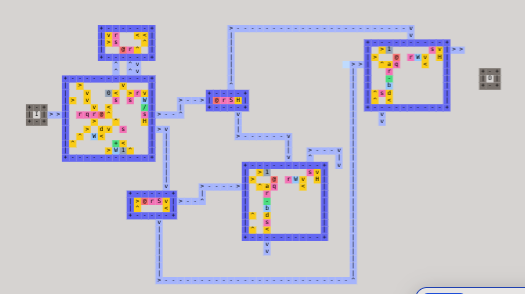
</p>
<p align="center"><em>Oh, that magic feeling, nowhere to go!</em></p>

Thankfully, prefixing the length of the list on the same pipe works even better
(so `1 2 3` becomes `3 1 2 3`). There's a lot of needless copying, but elbow
grease got me to this layout which divides a list into two lists greater than and
less than the average (both prefixed with their own lengths).

<p align="center">
  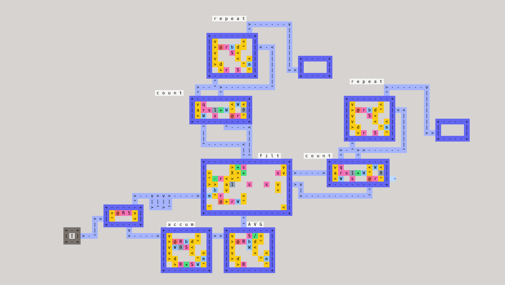
</p>

For this to work, I just need to recurse by feeding the two lists back into the
first box in order... but now we're back to the problem of stack frames.  How do
I make sure the less thans fully recurse before the greater thans
start?[^optimize]

[^optimize]: One thought I had was that, since the list will never be more than
    16, you could just do it over and over for log base 2 of n iterations, after
    which each half MUST have fully recursed, and then pull the values out of a
    list like `1 -5 1 -4 1 0 1 10`. But that was also wrong in the worst case
    anyway.

No matter what I'd still have to fiddle with a lot more flow tediousness. It
started to look like this was obviously the wrong approach. Discouraged, I lost
a lot of my pace.

## Day 3

### Please, something

Trying to return to my second lesson, I discarded the sorting problem completely.
After all, getting _an_ answer to other problems was still worth points. What if
I just wrote the dumbest thing I was sure could work?

### Problem 5: History

<em>History</em> was just a program that dumped a specific sequence of numbers.
What's the dumbest way to write it? I mean worst-submission-that-still-passes
dumb. How about a single line that has every number typed out and sends them one
by one? [dump.lisp](../dump.lisp) handled that in the only actual code I wrote
this contest.

<p align="center">
  
</p>
<p align="center"><em>
    <a href="http://www.harkavagrant.com/index.php?id=125">
        awww yiss
    </a>
</em></p>

It seems like there are several obvious ways to have improved that
standing[^history]. But that's not what we're here for! We're doing stupid simple
things, quickly. On to the next.

[^history]: Like taking the square of the length and compressing with
    boustrophedon. Or different bases, or Huffman encoding. Maybe there's even
    something clever that lets you reuse individual digits?

As a bonus and reassurance at this point, I realized I could trim an instruction
from _Triangle_ and finally condense my shape into 8x8. Not the perfect solution,
but still an improvement![^rewrite]

[^rewrite]: It turns out I completely forgot that rewriting is a thing, and that

    `n(n + 1) / 2 = (n^2 + n) / 2`

    You never need the 1 in the first place and can just apply `*` `+`.
    \*sigh\*

<p align="center">
  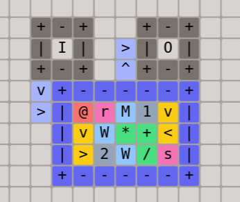
</p>

### Problem 2: Memory
With the time I had left I turned back to _Memory_, in which we have to be able
to persist and read back up to 100 values. I could either: store the numbers in a
pipe (and worry about cycling through it) or have little men hold all the
numbers. It wasn't too hard to imagine how to have a man whose only job was to
remember:

<p align="center">
  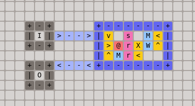
</p>
<p align="center"><em>My little monk</em></p>

Plus rooms seemed like the dumber idea of the two. Could I just copy paste it 100
times and have one more little man ask each of them for their number when
relevant? I could.

<p align="center">
  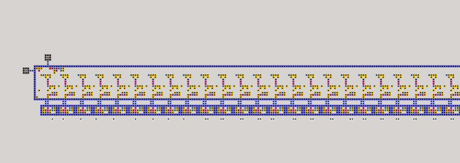
</p>
<p align="center"><em>My little abbey</em></p>

As soon as the memory was working (debugged in the final hours of the contest) it
started to seem pretty obvious that it could be paired with machine instructions
and a virtual CPU instead of worrying about room layouts. Honestly, I'm not sure
how well I could have pulled it off, but I did regret waiting on `Memory`.

I was surprised to find that I had already gained some fluency with the little
man language. At one point I was scribbling out unintelligible code in my
notebook while in a restaurant. Immersion is the best teacher!

<p align="center">
  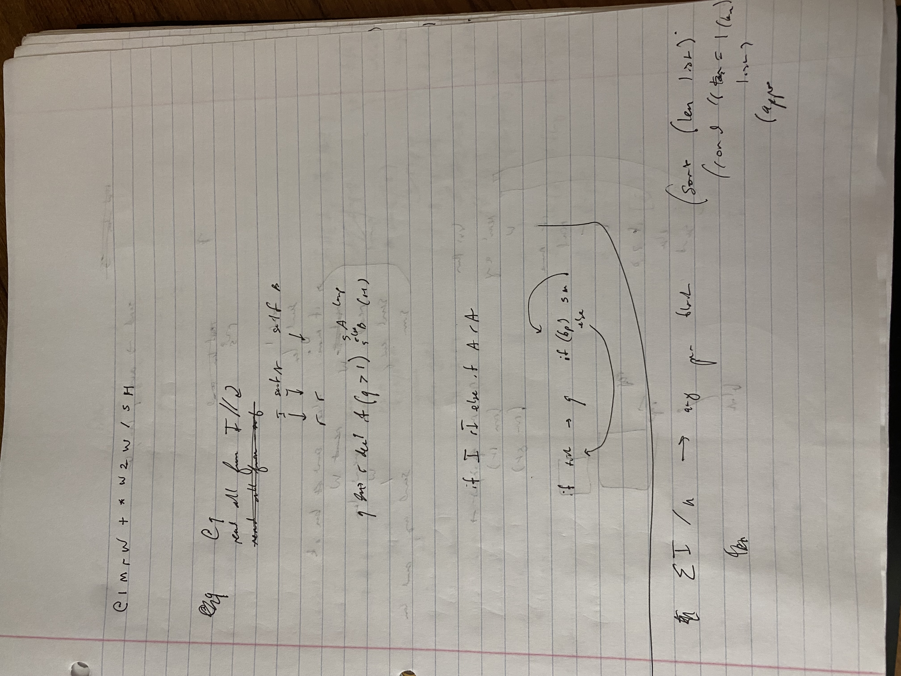
  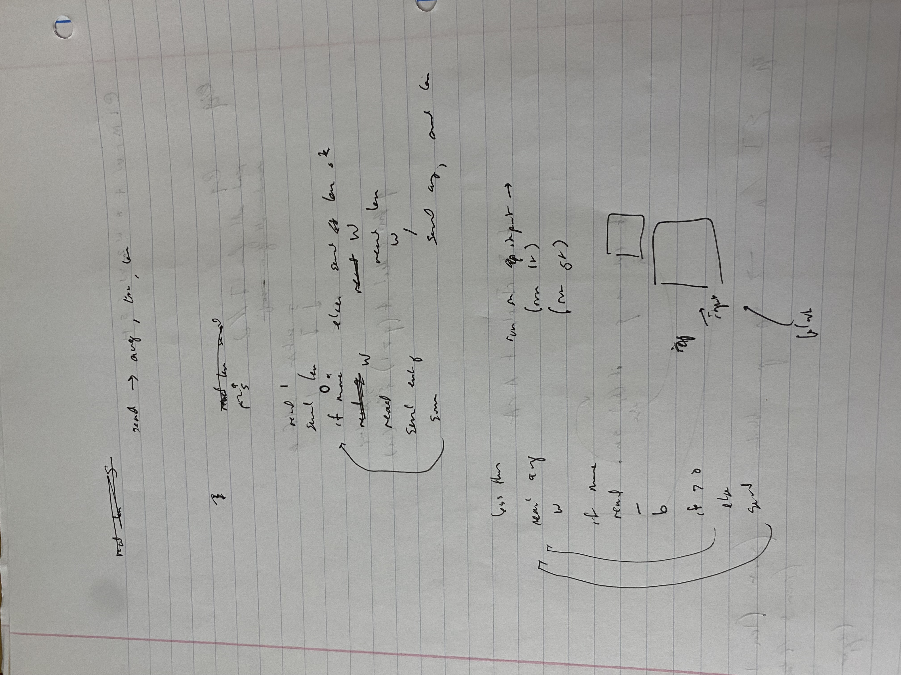
  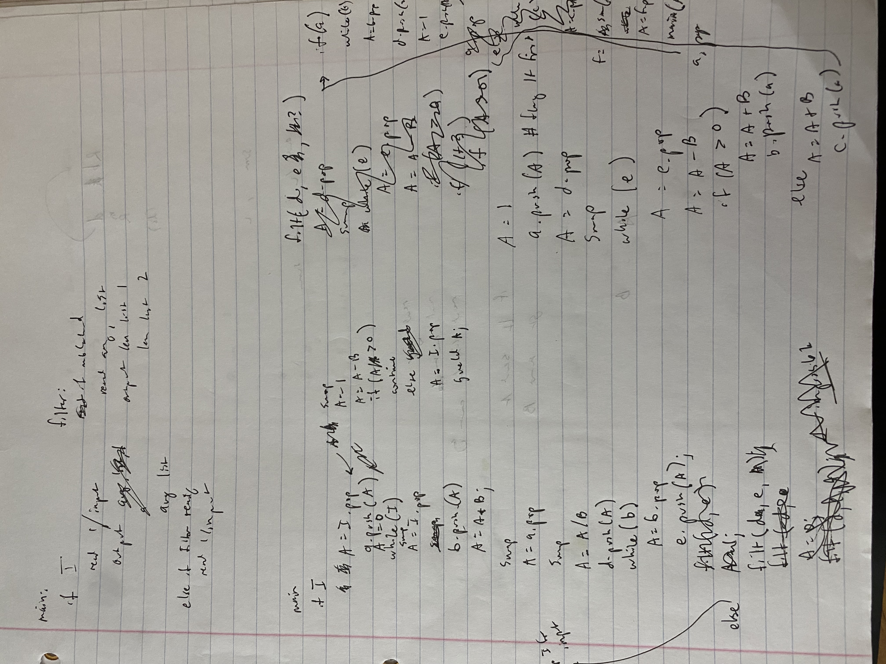
</p>

## The elephant

Yeah, it's AI. Every contestant was thinking about it. Several teams employed it
significantly for the first time this year. The organizers explicitly
designed the problem to be difficult to simply churn on a model, but teams with
limited or even minimal interaction vibed into positions competitive with top
players.

It's strange--this year's contest produced such tremendous joy, yet there seems
(to me) to be a somber air in the aftermath. If we see the same pace of
improvement in the future, what will this sort of contest mean? Do you pivot to
'who uses LLMs best'? Or, 'who codes the best, you know, that thing we used to
do?' Assuming we haven't found ourselves in [much, much worse
territory](https://huggingface.co/blog/agent-intrusion-technical-timeline) by
then. [Centaurs](https://en.wikipedia.org/wiki/Advanced_chess) might be best today. I
don't see a reason to expect that to continue.

I'd say I wish I had an answer, but I fear I wouldn't like it.

For now, I enjoyed my approach enough that I lean towards avoiding AI and
contenting myself with the bottom of the rankings next time. If coding does
regress to a hobby, I'd at least like to use it for goofiness like this!

## Final Thoughts

At the time of the score freeze, I was ranked 157 out of 268: 40th
percentile! Coming from the previous year's 10th percentile, I think I have no
choice but to call this a huge success.

Ironically, I wonder if I overcorrected towards taking things easy. I probably
could have fought through at least a couple more problems or even taken a more
ambitious tack towards the hard parts. Either way, I once again had a great time
participating and I'm massively thankful to the organizers for their effort. I'll
have to figure out the right balance in 2027!

<p align="center">
  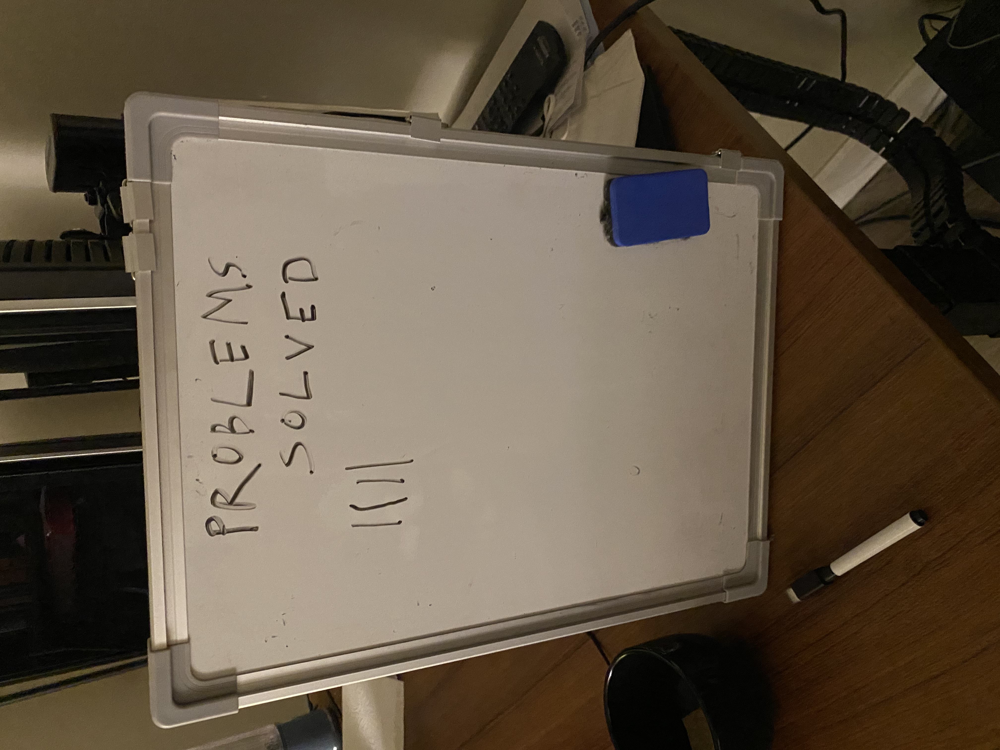
</p>
